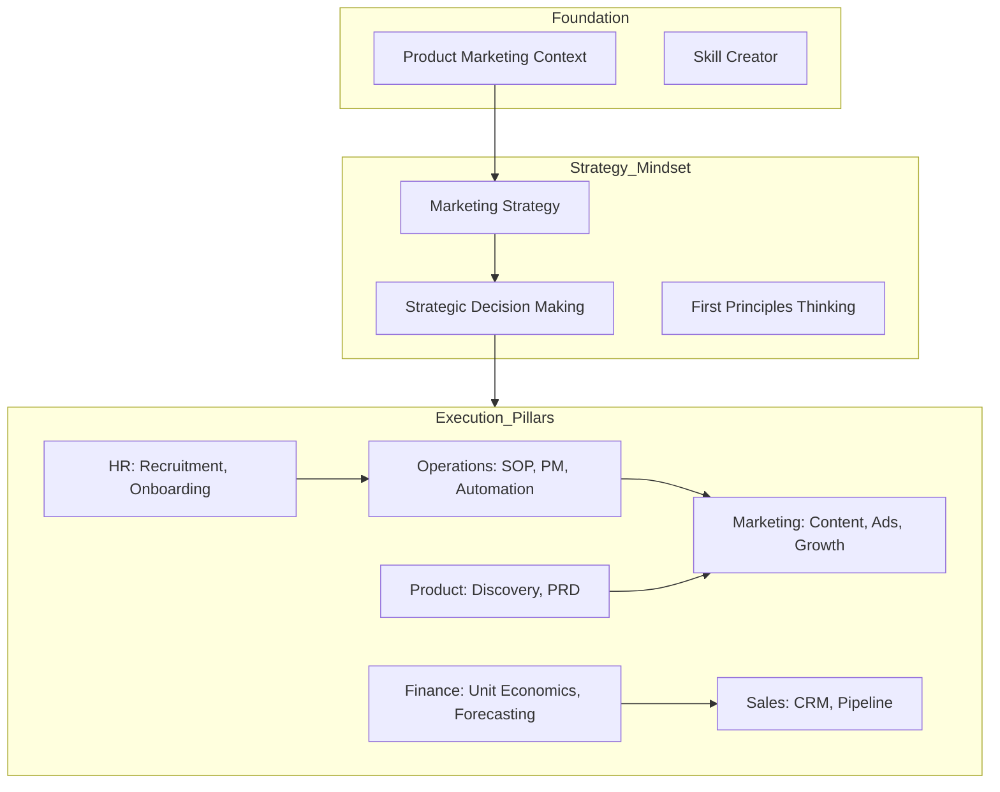

# 🚀 Business Skills Library

[](./LICENSE)
[](./SKILL.md)
[](https://workflow.ai.vn)
[](./AGENTS.md)

Chào mừng bạn đến với **business-skills** – Thư viện "Modular Business Skills" dành cho AI Agents. Repo này được xây dựng nhằm giúp các chủ doanh nghiệp, nhà quản lý và marketer tối ưu hóa việc sử dụng AI (Claude, ChatGPT, Cursor, Dify...) thông qua các bộ khung kỹ năng (skills) được chuẩn hóa.

> 🇻🇳 **Điểm đặc biệt**: Repo này được tối ưu hóa cho **thị trường Việt Nam** — có các kỹ năng chuyên biệt cho Zalo OA, TikTok Shop, Shopee, Livestream và KOC Việt mà các repo nước ngoài không có.

## 🎯 Mục tiêu
- **Modular hóa kiến thức**: Biến các kỹ năng kinh doanh phức tạp thành các module mà AI có thể hiểu và thực thi ngay lập tức.
- **Agentic Agency OS**: Evolve từ một thư viện marketing thành một hệ điều hành doanh nghiệp toàn diện, cho phép AI Agents điều phối (Orchestrate) nhiều kỹ năng cùng lúc.
- **Tương thích đa nền tảng**: Dễ dàng tích hợp vào Claude Projects, Custom GPTs, Cursor, và các hệ thống Agentic Workflow.

## 🛠 Cách sử dụng
Bạn có thể sử dụng repo này theo nhiều cách:
1. **Claude Projects**: Tải thư mục `skills/` lên Project Knowledge để AI nắm vững bối cảnh và kỹ năng.
2. **Custom GPTs**: Sử dụng file `SKILL.md` hoặc các file skill cụ thể làm hướng dẫn (Instructions).
3. **Cursor/Continue**: Tham chiếu các file skill khi yêu cầu AI viết nội dung hoặc lên kế hoạch kinh doanh.
4. **Agentic Workflows (Dify/n8n)**: Sử dụng các file `.md` làm System Prompt cho các node xử lý.

> Xem hướng dẫn chi tiết tại [AGENTS.md](./AGENTS.md).

## 📂 Cấu trúc thư mục
```text
business-skills/
├── README.md                    # Giới thiệu tổng quan
├── SKILL.md                     # Master Prompt - "Bộ não" điều phối
├── SKILL-AUDIT.md               # Hệ thống đánh giá chất lượng skills
├── AGENTS.md                    # Hướng dẫn triển khai trên các nền tảng
├── CONTRIBUTING.md              # Hướng dẫn thêm skill mới
├── LICENSE                      # Giấy phép MIT
├── skills/                      # Thư viện các kỹ năng chuyên biệt
│   ├── foundation/              # 📋 Nền tảng (Context, Skill Creator)
│   ├── strategy/                # 🎯 Chiến lược (Marketing, Launch, Pricing, MarCom)
│   ├── ops/                     # ⚙️ Vận hành (CSKH, SOP, Automation, PM, Meeting, Reporting)
│   ├── finance/                 # 💰 Tài chính (Unit Economics, Planning)
│   ├── product/                 # 📦 Sản phẩm (Discovery, PRD Writing)
│   ├── hr/                      # 👥 Nhân sự (Recruitment, Onboarding, CV Screening)
│   ├── sales/                   # 🤝 Bán hàng (Sales Strategy, CRM, Lead Scoring)
│   ├── legal/                   # ⚖️ Pháp lý (Compliance, TOS/Privacy)
│   ├── mindset/                 # 🧠 Tư duy (First Principles, Decision Making)
│   ├── research/                # 🔬 Nghiên cứu & Phân tích
│   ├── content/                 # ✍️ Nội dung & Sáng tạo
│   ├── ads/                     # 📢 Kênh & Quảng cáo (Zalo OA, TikTok Shop, Shopee, Paid Ads, SEO)
│   └── growth/                  # 🚀 Tối ưu & Tăng trưởng
│
└── examples/                    # Các ví dụ và case study thực tế
    ├── BEFORE-AFTER.md          # So sánh hiệu quả trước và sau khi dùng skill
    └── SQUAD-CASES.md           # [NEW] Cách phối hợp đa kỹ năng (Orchestration)
```

## 🗺 Sơ đồ liên kết Skills (Orchestration Map)



## ✍️ Cách thêm Skill mới
Chúng tôi khuyến khích cộng đồng đóng góp thêm các kỹ năng mới. Hãy đọc [CONTRIBUTING.md](./CONTRIBUTING.md) để biết cách định dạng file skill đúng chuẩn.

## 🚀 Quick Start

```bash
# Clone repo
git clone https://github.com/viethahong/business-skills.git

# Dùng ngay với Claude — copy nội dung này vào Custom Instructions
cat SKILL.md

# Hoặc dùng với Cursor — index toàn bộ thư mục skills
cursor business-skills/
```

Xem hướng dẫn chi tiết tích hợp Claude, GPT, Dify, n8n tại **[AGENTS.md](./AGENTS.md)**.

## 📜 Giấy phép
Dự án này được phát hành dưới giấy phép [MIT](./LICENSE).

---
*Phát triển bởi [viethahong](https://github.com/viethahong) • Website: [workflow.ai.vn](https://workflow.ai.vn)*

